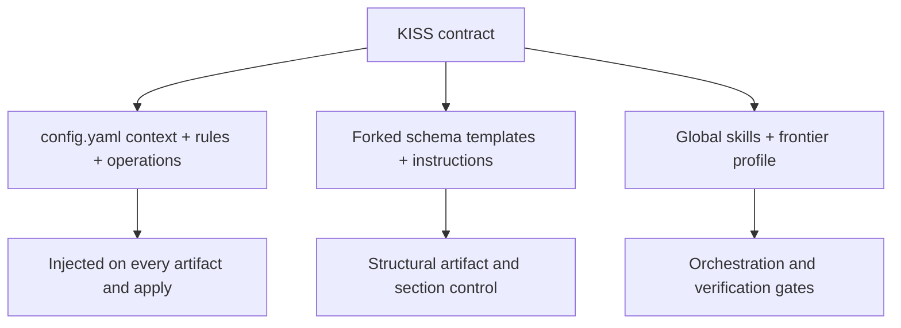

# KISS Planning Contract for OpenSpec

Status: Implemented 2026-09-22. Layers 1-3 are in place. Schema fork deferred
(rollout step 5): config and profile first. The real-change comparison
(rollout step 4) and the optional standalone `kiss-planning` skill remain open.
Scope: Global TUI skills, project OpenSpec configuration, and artifact scaffolding.

## Problem

Max-effort planners (observed with GPT 5.6 Luna Max and Deepseek V4.1 Flash Max)
overengineer OpenSpec changes. Symptoms:

- Speculative requirements for problems that are absent or can be ignored.
- Invented risks, fallbacks, migration paths, and rollback plans that no
  accepted requirement needs.
- Exaggerated problem statements that inflate the proposal before any design
  work happens.
- Over-broad capability lists that multiply into unnecessary spec files.
- Task lists padded with defensive work unrelated to the stated objective.

The result is slower planning, larger review surfaces, and more builder
delegation than the change justifies.

## Root cause

Every current rule is additive. Nothing establishes a minimalism default.

- `openspec/config.yaml:11` requires scope, non-goals, risks, fallback, and
  compatibility for every proposal.
- `openspec/config.yaml:16` requires trade-offs, migration, and rollback for
  every design.
- `openspec/config.yaml:28` pushes "split risky changes into smaller steps"
  with no ceiling on step count.
- `openspec/frontier_builder_profile.md:20-35` repeats the same exhaustive
  posture per artifact.
- `~/.config/opencode/skills/openspec-workflow/SKILL.md:48-53` re-encodes the
  additive baseline for every bootstrapped project.
- `.opencode/skills/openspec-continue-change/SKILL.md:104` states that each
  capability listed in the proposal needs its own spec file, so one over-broad
  capability list forces N scaffolds.

A high-effort model reads "MUST enumerate risks/fallback/rollback/migration" and
generates all of them. There is no counterbalancing rule that says the smallest
change satisfying the requirement is the default, that additions must be
justified, or that unrequested problems are out of scope. The only anti-bloat
precedent in the skill corpus is
`~/.config/opencode/skills/agents-md-maintenance/SKILL.md:20-34`, which is
scoped to `AGENTS.md` only.

## Design

Introduce KISS as a minimalism contract that layers over the existing two-layer
MUST/SHOULD contract. It does not replace the contract; it constrains
expansion. The contract lives in three durable layers that `openspec update`
does not overwrite, plus an on-request drift check.



### Mechanism over adjectives

"Be simple" does not constrain a Max-effort planner. These mechanisms do, and
they belong in the contract text:

1. **Default to smallest.** The minimal change satisfying the stated
   requirement is the default; larger designs need an explicit reason.
2. **Justify every addition.** Each capability, requirement, and task must
   trace to a stated need. Untraceable items are removed, not deferred.
3. **State the smaller alternative.** Every design records the simplest
   option considered and why it was rejected. If none was, the design is not
   done.
4. **Non-goals are enforced.** Listed non-goals cannot reappear as
   requirements or tasks.
5. **Delete before add.** Prefer removing a rule, artifact, or task over
   adding a new one.
6. **Budgets, not adjectives.** Hard caps on capability count, spec files, and
   tasks give the model a concrete boundary.
7. **Do not invent problems.** Speculative risks and hypothetical edge cases
   are out of scope unless an accepted requirement names them.

### Layer 1: `openspec/config.yaml`

Cheapest and most reversible layer. Config is user-authored and survives
`openspec update`. It reaches every artifact and `apply`, but note two
constraints from the OpenSpec docs: rules **add to** built-in instructions and
never replace them, and `verify` never receives `rules`. Keep the text short;
everything here lands in the agent context. Draft additions:

```yaml
context: |
  KISS applies to all planning. The smallest change that satisfies the stated
  requirement is the default. Every capability, requirement, and task must
  trace to a stated need; untraceable items are removed. Do not invent risks,
  edge cases, fallbacks, or migration work that no accepted requirement names.
  Prefer deleting a rule or task over adding one. Non-goals are binding and
  must not reappear as requirements or tasks.

rules:
  proposal:
    - MUST list the smallest capability set; each capability needs a one-line justification.
    - MUST NOT include speculative risks or hypothetical edge cases not tied to the objective.
    - SHOULD cap the proposal at three capabilities unless the objective requires more.
  design:
    - MUST record the simplest alternative considered and why it is insufficient.
    - MUST NOT add architecture, abstractions, or migration work no requirement needs.
  specs:
    - MUST create one spec file per capability and no more; merge overlapping capabilities.
    - SHOULD keep each requirement scenario set minimal and outcome-focused.
  tasks:
    - MUST trace every task to a requirement; drop untraceable tasks instead of deferring them.
    - SHOULD prefer the smallest task set that verifies the requirement.

operations:
  apply:
    guidance:
      - Reject edits not traceable to a task or requirement; do not expand scope.
```

The existing exhaustive rules (fallback, rollback, compatibility) should be
softened from unconditional MUST to conditional: required only when the change
actually has a migration, compatibility, or failure surface. On its own, this
single edit removes most of the speculative padding.

### Layer 2: Forked schema

Config adds rules but cannot drop an artifact or rewrite a template. When the
built-in templates or the `design` artifact itself drive the bloat, fork the
schema. This is the supported structural lever.

```bash
openspec schema fork spec-driven spec-driven
openspec schema validate spec-driven
```

Forking to the same name shadows the built-in, so `config.yaml` needs no
`schema:` change. Edit `openspec/schemas/spec-driven/templates/*.md` and the
per-artifact `instruction:` fields in `schema.yaml` to trim sections and encode
the KISS contract. Candidate structural changes:

- Drop or shrink `design.md` for changes with no architecture surface.
- Remove migration, rollback, and trade-off prompts from templates unless the
  instruction makes them conditional.
- Add a required "Simplest alternative considered" section to `design.md`.
- Add a "Smaller option / why not" line to `proposal.md`.

Trade-off: a fork is a snapshot. `openspec update` never touches
`openspec/schemas/`, so it keeps working, but it stops receiving upstream
template improvements. Port changes by re-forking under a new name and diffing.

### Layer 3: Global skills and frontier profile

These files are authored locally and are not CLI-managed.

- `openspec/frontier_builder_profile.md`: add a "Minimalism Contract" section
  alongside the MUST/SHOULD layers, containing the seven mechanisms above.
- `~/.config/opencode/skills/openspec-workflow/SKILL.md:44-53`: add a KISS
  baseline guardrail so new projects stop inheriting an exhaustive-only
  contract. Reference the minimalism contract by path.
- `~/.config/opencode/skills/openspec-build-loop/SKILL.md`: add an
  anti-scope-creep gate at the Planner Verification Gate (around `:180-204`)
  and the Completion Gate (`:206-216`). Reject tasks and edits not traceable to
  a requirement. The line "run broader checks when the task scope warrants
  them" (`:188`) is itself an invitation to widen scope and should be
  constrained.
- Optional: a global `kiss-planning` skill as the single source of truth for
  the contract text, referenced by the other skills so the wording does not
  drift across four files.

### Drift check (on request)

A global skill can reconcile on request, but it must not patch the generated
`.opencode/skills/openspec-*` files. Those are CLI-managed, carry a
`generatedBy` version stamp, and are candidates for overwrite on
`openspec update`. Their content is thin orchestration; the overengineering is
produced by schema templates and config, which patching a skill cannot touch.

The useful check reconciles the durable layers instead:

1. Read `generatedBy` from `.opencode/skills/openspec-*/SKILL.md` and compare
   against `openspec --version` and a stored baseline.
2. If the version advanced, diff the built-in `spec-driven` schema against the
   local fork and report new or changed templates and instructions to port.
3. Assert the KISS rules and context are still present in `openspec/config.yaml`
   and the minimalism contract is present in
   `openspec/frontier_builder_profile.md`.
4. Report drift and proposed ports; do not edit generated skills.

```text
KISS Drift Check:
CLI:            <installed version>
Skills stamp:   <generatedBy or mixed>
Schema fork:    current | behind | missing
Config rules:   present | missing | partial
Profile:        present | missing
Action:         port schema diff | restore rules | none
```

## Non-goals

- Do not patch or fork `.opencode/skills/openspec-*` generated by the CLI.
- Do not remove security, verification, compatibility, or fail-closed rules to
  shorten an artifact.
- Do not reintroduce a fixed line-count target; optimize for signal density and
  the smallest sufficient change.
- Do not weaken the two-layer MUST/SHOULD contract; KISS constrains expansion
  within it.
- Do not make KISS a blocking validator that rejects valid large changes.
  Genuinely large objectives still need large plans.

## Rollout

1. Edit `openspec/config.yaml` context, rules, and operations. Reversible and
   highest impact.
2. Add the Minimalism Contract to `openspec/frontier_builder_profile.md`.
3. Add KISS guardrails and the drift check to the global `openspec-workflow`
   and `openspec-build-loop` skills.
4. Run one real change and compare artifact size, capability count, and task
   count against a comparable pre-KISS change.
5. Fork the schema only if steps 1-2 do not sufficiently constrain templates.
6. Update this plan or archive it once the contract is in use.

## Open questions

- Whether to fork the schema at all, or rely on config rules first.
- Whether the KISS contract should also apply to non-OpenSpec report writing.
- Whether a standalone `kiss-planning` skill or edits to the existing skills is
  the better single source of truth.
- Whether capability and task budgets should be configurable per project.

## References

Local:

- `openspec/config.yaml:11,16,28` additive rules.
- `openspec/frontier_builder_profile.md:20-35` additive artifact rules.
- `~/.config/opencode/skills/openspec-workflow/SKILL.md:44-53` bootstrap guardrails.
- `~/.config/opencode/skills/openspec-build-loop/SKILL.md:180-216` verification and completion gates.
- `~/.config/opencode/skills/agents-md-maintenance/SKILL.md:20-34` precedent for signal-density guidance.
- `.opencode/skills/openspec-continue-change/SKILL.md:104` capability-to-spec multiplier.
- `.opencode/skills/openspec-new-change/SKILL.md:9` CLI version stamp.

OpenSpec documentation:

- Project configuration: https://openspec.dev/docs/project-config
- Custom schemas: https://openspec.dev/docs/customize-schemas
- CLI update: https://openspec.dev/docs/cli
- Supported tools: https://openspec.dev/docs/supported-tools
