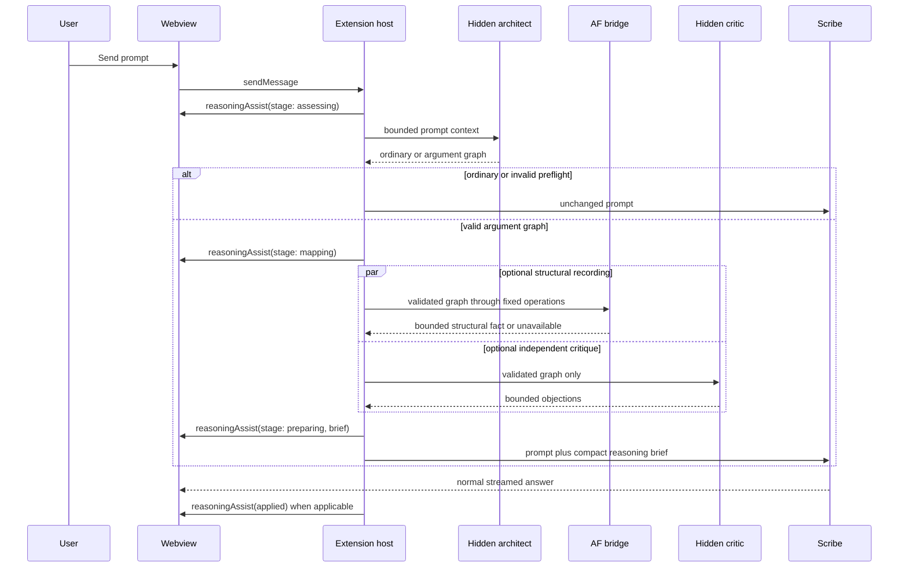

# Vibefeld Reasoning Assist for OpenCode Scribe

## Status

This is a proposed replacement direction for the raw-prose `Reasoning Review`
flow described in `plans/vibefeld-scribe.md`. It is a product and
implementation plan only. It does not activate AF, add an unrestricted model
tool, expose private reasoning, or change normal Chat and Write behavior until
its OpenSpec change is implemented and verified.

The existing post-response review path is not a useful user-facing capability:
it forwards ordinary assistant prose to a compiler that accepts only a private
line protocol (`CONCLUSION`, `CLAIM`, `ASSUMPTION`, `DEPENDS`, and `EVIDENCE`).
Normal prose therefore maps to `blocked`. The user must never be expected to
write that protocol or to coerce Scribe into emitting it.

## Product Goal

Give Scribe a small, automatic reasoning assist for argument-heavy work. It
should help Scribe produce clearer, better-calibrated research and philosophy
answers without turning ordinary chat into a multi-agent workflow or requiring
the user to manage AF syntax, modes, agents, or proof workspaces.

For a likely argument, Scribe creates a bounded argument map before answering,
uses AF only when AF can add a real structural fact, obtains at most one
independent devil's-advocate critique, and gives the resulting compact brief to
the normal Scribe request. The normal answer then streams as it does today.

The feature is an aid to reasoning and exposition. It is not a theorem prover,
fact checker, source verifier, or disclosure of private chain-of-thought.

## KISS Decisions

1. There is one automatic preflight, not a visible `Argument Mode` button.
   The preflight classifies a prompt as `ordinary` or `argument` and builds a
   graph only for the latter.
2. The preflight is the argument architect. It uses the selected, host-pinned
   Scribe model in a hidden, tool-less session and returns schema-constrained
   data, not prose intended for the user.
3. The main Scribe model is the author and synthesizer, not a prover. A single
   hidden devil's-advocate stage is the only independent model stage in the
   first release.
4. Do not add a verifier in the first release. A verifier is justified only by
   measured evidence that the critic routinely emits irrelevant or misleading
   objections.
5. AF is host-owned and invisible to the model. The model cannot choose an
   executable, verb, path, workspace, or argv. The host validates the graph and
   invokes only contracted fixed operations.
6. AF must not be put on the critical path merely to store a flat tree. Until
   captured AF operations can represent the required dependency or challenge
   facts, AF output is described only as a recorded structure, never as a
   logical validation.
7. A preflight failure must not block an answer. Scribe falls back to ordinary
   streaming with no persistent warning card.
8. The webview shows concise, user-facing activity and artifacts. It must not
   reveal raw model reasoning, hidden prompts, child-session output, tool
   payloads, AF ledgers, paths, or private chain-of-thought.
9. No response gate, no delayed release after an answer is generated, no
   automatic post-response re-audit, and no notebook in the first release.

## User Experience

### Ordinary Prompt

For a greeting, translation, simple lookup, creative request, command, or
other prompt where structure would not help:

1. The host runs the bounded preflight classification.
2. It returns `ordinary`.
3. The host immediately dispatches the unchanged prompt to the normal Scribe
   request.
4. No reasoning-assist panel, review card, spinner, or follow-up work remains
   in the transcript.

The classification work is intentionally small and must have a strict timeout.
The UI must not imply that an argument review occurred for ordinary prompts.

### Argument Prompt

For a prompt such as an Everettian relative-state claim, an evidence-heavy
recommendation, or a multi-step philosophical argument, the webview attaches a
small expandable `Reasoning assist` row to the pending user message. It emits
progress as the host completes stages:

```text
Reasoning assist
  Assessing whether structure will help
  Mapping the central claim and assumptions
  Checking the argument structure
  Testing the strongest objection
  Preparing the answer
```

These are progress labels, not a transcript of hidden thought. The final row
may expand to show only bounded, user-facing artifacts:

- Candidate conclusion
- Material assumptions
- Evidence needs or uncertainty boundary
- Up to two unresolved objections
- `AF structure recorded`, only when the bridge returns a contracted result

Once the preflight brief is ready, the normal Scribe answer starts streaming.
The progress row changes to `Applied to this response` after dispatch. It stays
attached to the resulting answer only when there is a valid argument brief.

There is no blank waiting state. The first activity event is published before
the host starts the preflight. If the preflight does not yield a valid graph,
the activity row is removed and normal streaming proceeds.

### Explicit Follow-Up

The first release has no `Review argument` action on arbitrary completed
answers. That action is the source of the current guaranteed-`blocked` UX.

For a response produced with a valid preflight brief, the webview may offer
`Show argument map` and `Hide argument map`. These actions only expand or
collapse already stored summary data; they never start new work.

An explicit `Check answer against argument` action is deferred. If added later,
it compares the final response to the preflight graph and critique. It does
not send raw final prose directly to the AF graph compiler.

## End-to-End Flow



The host is the workflow manager. “Scribe decides when to use AF” means that
the host asks the small preflight to classify and map the current request; it
does not mean that the main model receives an AF tool or arbitrary execution
authority.

## Input Scope

The architect receives only:

- The new user text, bounded to the existing prompt limits
- A small host-selected context window from the same session, initially the
  immediately preceding user and assistant turns when present
- A compact prior argument summary only when one is already attached to the
  same active thread
- Metadata needed to identify the selected Scribe model and primary agent

The architect does not receive tool results, raw reasoning parts, host paths,
workspace content, attachments, credentials, AF output, or unrestricted
conversation history. Attached files remain available to normal Scribe under
the established product rules but are excluded from the first preflight.

The host determines eligibility before opening a hidden session. Exclude
commands, question/permission interactions, pending/retried prompts, shell
handoff, and non-Scribe primary agents. Normal Scout and Write text prompts are
eligible. The preflight itself is the only classifier; do not add a second
heuristic router or a user-facing mode selector.

## Argument Architect Contract

The architect is a hidden, tool-less child session built from the existing
restricted-context mechanism. It uses a fixed host instruction and exact JSON
schema. It must not call tools, read files, ask questions, or produce a normal
chat reply.

Its only successful outputs are:

```ts
type OrdinaryPreflight = {
  kind: "ordinary";
};

type ArgumentPreflight = {
  kind: "argument";
  conclusionId: string;
  claims: Array<{
    id: string;
    class: "deductive" | "computational" | "empirical" | "procedural" | "interpretive" | "normative";
    statement: string;
    dependsOn: string[];
  }>;
  assumptions: Array<{
    id: string;
    claimId: string;
    statement: string;
  }>;
  evidenceNeeds: Array<{
    claimId: string;
    status: "not_required" | "source_recorded" | "unverified" | "human_verified" | "conflicted";
  }>;
  uncertainty: string[];
};
```

The exact production schema must be narrower than this illustration: exact
keys, identifier rules, hard list limits, statement limits, safe text rules,
and no unrecognized values. Host validation converts it to the existing private
`ClaimGraph` shape. It rejects cycles, duplicate identifiers, missing
dependencies, invalid claim classes, unsafe content, and over-limit data.

An invalid, empty, malformed, timed-out, cancelled, or unavailable architect
result is not an argument failure. It means `no assist for this prompt`; the
host dispatches the normal message with no preflight brief.

The architect is fallible. Its job is to expose a useful proposed structure,
not to establish truth. The main answer must label interpretive, empirical, and
normative claims with appropriate uncertainty.

## AF Integration

### Current Limitation

The current AF bridge can capture and run `init`, `claim`, `refine`, and
`status`. The current projection records a root conclusion and child statements
and derives success from expected operation and node counts. It does not
currently project `logicalDependencyIds` or challenge relations.

Therefore, this change must not map that result to `structurally_checked` for a
philosophical or scientific argument. Successful recording may appear in the
private brief and user-visible panel only as `AF structure recorded`.

### Required Behavior

1. The host runs AF only with a graph that passed the architect and local graph
   validators.
2. AF receives no raw prompt and no model-controlled command strings.
3. AF operations remain fixed argv, `shell: false`, bounded I/O, bounded time,
   and host-owned workspace/executable selection.
4. AF unavailability, malformed output, timeout, cancellation, or audit failure
   must not suppress the compact architect brief or the normal Scribe answer.
5. The main Scribe brief includes an AF fact only if a real contracted bridge
   result exists. It never infers AF success from compatibility, discovery, or
   an empty workspace.
6. A later AF relation/challenge capability requires a separate capture-first
   OpenSpec change. It must observe real CLI operations and output shapes before
   extending the operation union. It must not invent an AF verb.

## Independent Critic

The existing restricted prover/verifier design is reusable, but v2 starts with
one role: `critic`.

The critic receives only the validated graph and a fixed instruction to return
at most two material objections. Each objection names a claim or assumption,
has a bounded severity, and gives a concise reason. It may challenge an
unsupported dependency, a hidden assumption, an ambiguity, or an evidence gap.
It must not claim external truth, read sources, use tools, or access AF.

The host validates, bounds, and redacts the critic output. Invalid, irrelevant,
timed-out, cancelled, or unavailable critique is omitted rather than becoming a
persistent failure card. The main Scribe instruction treats every objection as
an item to address or qualify, not a fact to obey.

Run AF recording and the critic in parallel after graph validation. Both are
optional enrichments. The main request begins when the bounded preflight budget
expires or both requested stages settle, whichever comes first. A timed-out
stage is cancelled and cleaned up; there are no retries or degraded sandbox
paths.

The current two-role prover/verifier pipeline remains dormant. Add a verifier
only in a later change with measured review quality evidence and a clear reason
to pay for another model call.

## Main Scribe Brief

The host constructs one bounded system addition from validated facts only:

```text
Reasoning assist brief
Candidate conclusion: ...
Material assumptions: ...
Evidence boundary: ...
Independent objections to address or qualify: ...
AF fact: structure recorded | not available

Write the user's requested response directly. Do not mention this brief unless
it materially improves clarity. Do not state that a claim is proven, factually
verified, or formally checked merely because it appears in the brief.
```

This brief is appended through the existing host-owned system-prompt path when
dispatching the original prompt. It is not added as a user message, persisted as
an OpenCode message part, made visible to tools, or returned as a child-agent
transcript.

The original user prompt remains unchanged. Scribe preserves normal answer
streaming after the preflight has settled.

## Webview and Protocol

Add a dedicated provider-neutral assist lifecycle rather than overloading a
post-response `ReasoningReviewSummary`.

```ts
type ReasoningAssistStage = "assessing" | "mapping" | "recording" | "critiquing" | "preparing" | "applied";

type ReasoningAssistProgress = {
  sessionId: string;
  promptId: string;
  stage: ReasoningAssistStage;
  brief?: {
    conclusion: string;
    assumptions: string[];
    uncertainty: string[];
    openChallenges: Array<{ severity: "critical" | "major" | "minor" | "note"; target: string; reason: string }>;
    afState: "recorded" | "not_available";
  };
};
```

The exact shared type must be provider-neutral and must not contain graph IDs,
workspace paths, executable paths, raw packets, raw child output, ledger data,
or model reasoning.

The host owns lifecycle state keyed by session and prompt. The webview only
renders events for the active session and removes pending state when the prompt
is superseded, cancelled, fails preflight, is deleted, or the session changes.

The UI component is a compact expandable row associated with a user prompt and
the completed answer it informed. It is not rendered as streamed model
reasoning. Every string is localized in every webview locale dictionary.

## Cancellation, Ordering, and Failure Rules

1. A newer prompt in the same session cancels the active preflight before it
   begins normal dispatch.
2. Switching or deleting the active session cancels architect, critic, and AF
   work and suppresses late events.
3. A stale result can never add a system brief to a later prompt.
4. The host must await cleanup of hidden child sessions before starting a
   replacement preflight for the same prompt key.
5. Architect and critic child sessions are hidden, filtered from session lists
   and events, unretained, aborted, and deleted under the existing restricted
   lifecycle rules.
6. AF cancellation follows the existing bridge cleanup path. It does not retry
   under a weaker sandbox, alternate workspace, or arbitrary argv.
7. A preflight timeout is short and bounded. It falls back to an unchanged normal
   Scribe request rather than holding the UI.
8. No stage error, raw exception, provider text, pathname, URL, secret-like
   value, or diagnostic is published to the webview.

## Explicit Non-Goals

- No user-authored AF language or prompt formatting
- No general AF tool, plugin, MCP server, custom tool, or model-visible route
- No raw chain-of-thought display
- No response gate or answer rewrite after streaming begins
- No automatic re-audit of every completed answer
- No verifier, multi-round debate, loop, or unlimited subagents in the first
  release
- No notebook, cross-session argument memory, or automatic retention of graphs
- No source verification, external research, theorem-proving, or truth claim
- No global OpenCode configuration, profile, workspace, or TUI change

## Deferred Follow-Ups

### Answer Alignment Check

An explicit action can compare a completed response against its retained
preflight brief. It may identify omitted assumptions, unresolved objections not
addressed, or claims that drift from the planned conclusion. It must never parse
arbitrary prose through the current private line compiler.

### One Revision

For an explicit alignment check with material findings, construct a bounded
revision brief and send one new Scribe request. Preserve the original response
and show the revision separately. No automatic revision loop.

### AF Relations And Challenges

Capture and contract real AF operations that can express dependencies,
challenges, or resolutions. Only then may AF be described as supplying a
stronger structural fact than recorded nodes. This is a separate operation-
discovery and bridge change.

### Verifier And Argument Notebook

Add a verifier only with evaluation evidence. Add a user-visible notebook only
after the argument map produces useful, non-empty artifacts in live use. Store
only user-visible conclusions, assumptions, evidence gaps, objections, and
resolutions, never raw model thought or AF ledgers.

## OpenSpec Outline

Create one new change: `replace-vibefeld-raw-audit-with-reasoning-assist`.

```text
openspec/changes/replace-vibefeld-raw-audit-with-reasoning-assist/
  .openspec.yaml
  proposal.md
  design.md
  tasks.md
  specs/
    vibefeld-reasoning-assist/
      spec.md
```

### Proposal Scope

Replace raw completed-answer parsing with an automatic, bounded prompt
preflight. Add a hidden architect, optional one-stage critic, host-owned AF
recording integration, compact system brief injection, visible progress events,
and a prompt-linked webview panel. Retire the arbitrary-message `Review
argument` request and its persistent `blocked` outcome.

### Design Decisions

- Reuse `ClaimGraph` validation but make architect output, not assistant prose,
  its only production input.
- Generalize the existing restricted provider only as far as needed for a
  tool-less architect and a one-stage critic; keep host-pinned model selection,
  deny maps, hidden sessions, bounded retrieval, cancellation, and cleanup.
- Keep the primary Scribe answer on the normal `IAgent.sendMessage()` path and
  append the bounded brief via its existing host-built `system` string.
- Add provider-neutral assist progress types to `packages/core`; keep AF,
  graph, child-provider, and prompt-composition details in platform/agent
  packages.
- Run AF and critic concurrently only after a graph is valid. Neither may block
  the answer if it is absent or fails.
- Do not map AF node-recording success to `structurally_checked`.
- Keep automatic-routing evaluation separate. This preflight is prompt
  preparation, not post-response automatic auditing.

### Required Specification Scenarios

- An ordinary eligible prompt dispatches unchanged after a bounded `ordinary`
  preflight and leaves no persistent assist UI.
- A valid argument preflight produces a locally validated graph, publishes
  ordered progress, passes a bounded brief into the normal Scribe request, and
  leaves a compact expandable result after completion.
- Ordinary assistant prose is never passed to `compileClaimGraph()` by a
  production manual or automatic review path.
- A malformed architect response, timeout, cancellation, unavailable model, or
  invalid graph dispatches the unchanged prompt and does not publish `blocked`.
- A ready AF bridge records only validated graph facts through fixed operations;
  a missing or failed AF bridge does not prevent the main answer or cause a
  structural-success claim.
- A ready critic receives only a validated bounded graph, returns at most the
  allowed objections, and has no tools, files, shell, task, workspace, AF, MCP,
  plugin, or visible agent authority.
- The host includes only validated, bounded facts in the main system brief; raw
  architect/critic output and internal identifiers never reach the request,
  transcript, or webview.
- Session switches, deletion, retries, cancellation, and reconnects cancel
  preflight work, clean hidden sessions, and reject stale progress or briefs.
- Prompt dispatch remains normal streaming after preflight; no response gate,
  artificial assistant message, or post-stream rewrite exists.
- Every new user-facing string is localized.

### Task Breakdown

1. Establish the replacement boundary.
   - Inventory current manual and automatic review call sites that send raw
     assistant text to `compileClaimGraph()`.
   - Remove or retire the arbitrary completed-message review trigger from
     production wiring and UI.
   - Add regression tests proving ordinary prose cannot produce `blocked`.

2. Define provider-neutral assist contracts.
   - Add progress, compact brief, and prompt-scoped lifecycle types and typed
     host/webview messages in `packages/core`.
   - Keep private graph/AF/provider data outside core.
   - Add exact-shape, bounded, locale, and protocol tests.

3. Implement architect parsing and validation.
   - Add a fixed, tool-less architect prompt and strict JSON parser.
   - Reuse and adapt the restricted hidden-session provider for one architect
     call with a host-pinned model and bounded input/output.
   - Convert only valid architect output to `ClaimGraph`; test ordinary,
     argument, malformed, unsafe, cyclic, over-limit, cancellation, and timeout
     cases.

4. Implement the KISS critic.
   - Add a fixed one-stage critic contract with a maximum of two objections.
   - Reuse hidden-session redaction, cancellation, visibility filtering, and
     disposal; do not construct verifier contexts.
   - Test that the critic receives only a validated graph and cannot surface raw
     output or broader authority.

5. Add host orchestration and brief injection.
   - Integrate preflight into `ChatViewProvider.dispatchPrompt()` before the
     existing normal `agent.sendMessage()` call.
   - Publish lifecycle events as each stage settles.
   - Run AF recording and critic concurrently after validation.
   - Build one bounded system addition and preserve the original prompt,
     selected model, primary agent, files, skill, command, and effort options.
   - Implement prompt/session generation guards and cancellation.

6. Build the webview experience.
   - Add a compact prompt-linked `ReasoningAssist` component and session-scoped
     state.
   - Render progress immediately, remove failed preflight state, and retain only
     valid applied summaries.
   - Support expansion without triggering work and add every locale key.

7. Recalibrate AF presentation and security tests.
   - Present current successful AF projection only as recorded structure.
   - Preserve all AF execution, fixed-argv, bounded-I/O, sandbox, policy,
     workspace, and fail-closed negative coverage.
   - Add tests proving no model-visible AF route, no plugin/MCP/tool addition,
     no global configuration write, no raw chain-of-thought publication, and no
     response gate.

8. Verify.
   - Run focused core, agent, extension-host, and webview tests.
   - Run the relevant gated live restricted-context test only with explicit
     disposable-provider authorization.
   - Run `pnpm run check`, `pnpm run build`, `pnpm run test:all`, `openspec
     validate replace-vibefeld-raw-audit-with-reasoning-assist --strict`, and
     `git diff --check`.

## Release Criteria

The first release is complete only when:

- A user can submit ordinary prose and never needs to know AF syntax.
- Normal prose cannot yield a persistent `Blocked` argument-audit card.
- Argumentative prompts receive a valid compact brief before the main answer
  streams, or fail harmlessly into an unchanged ordinary answer.
- The user sees concise progress and bounded argument artifacts, not opaque
  waiting or private reasoning.
- The main answer can use the architect and critic findings through a bounded
  host-built brief.
- AF is used only for a real contracted result and is never overstated as proof
  or semantic validation.
- The critic is optional, tool-less, hidden, bounded, cleaned up, and unable to
  broaden Scribe's existing authority.
- Ordinary Chat, Write, Scout, sandbox, MCP, memory, TUI, and response
  streaming behavior remain unchanged when assist is inapplicable or unavailable.
