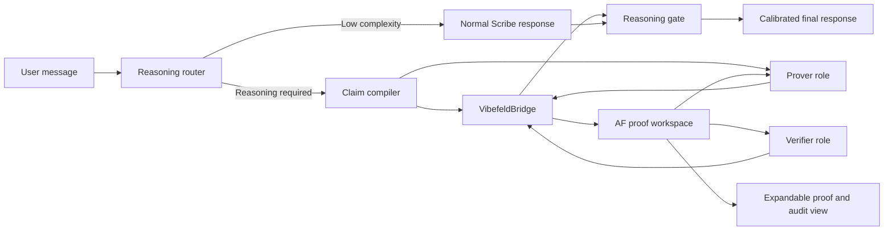

# Vibefeld Cortex for OpenCode Scribe: Implementation Plan

**Authored by LLM**

## Purpose

Integrate Vibefeld (`af`) into OpenCode Scribe as a persistent, adversarial reasoning subsystem rather than an occasional MCP-style utility.

The integration must improve the quality, traceability, and calibration of Scribe's reasoning across structured tasks without misrepresenting Vibefeld as a formal theorem prover or treating philosophical, empirical, or normative conclusions as mechanically settled.

The intended result is:

- Scribe detects when a response rests on a non-trivial argument.
- It represents that argument as a bounded claim graph.
- Vibefeld records claim structure, scope, dependencies, objections, acceptance provenance, and epistemic taint.
- A fresh verifier role pressure-tests the argument.
- Scribe's final wording is constrained by the current proof state.
- Users see a compact result and can inspect assumptions, challenges, and the Lamport-style proof tree when useful.

## Non-Goals

- Do not expose a general-purpose shell to the model.
- Do not invoke `af shell`.
- Do not treat `validated` as semantic proof in the Lean, Coq, or Isabelle sense.
- Do not make Vibefeld mandatory for casual conversation, creative work, or simple requests.
- Do not use a clean proof state as evidence that external sources, factual premises, or citations are true.
- Do not disclose private model chain-of-thought. Persist concise claims, stated assumptions, objections, and resolutions only.
- Do not let a successful formalizable subargument settle a philosophical, interpretive, legal, medical, ethical, or normative conclusion.

## Constraints and Design Principles

| Principle | Requirement |
|---|---|
| Direct integration | Implement as a native OpenCode plugin and reasoning lifecycle component, not an MCP server. |
| Least authority | The model has no `bash` tool. The bridge executes only the canonical `af` binary through an argument-vector API. |
| Workspace isolation | AF may read and write only a dedicated per-session proof directory. It must not write into the user repository by default. |
| Typed interface | Scribe calls typed bridge operations, never sends arbitrary command strings. |
| Bounded work | Limit nodes, depth, verifier passes, wall-clock time, output volume, and model cost. |
| Visible calibration | The response must distinguish verified structure, admitted assumptions, unresolved objections, and interpretation. |
| Role separation | Prover and verifier use separate identities, fresh contexts, and distinct prompts. Never permit `--allow-self`. |
| Evidence separation | Logical status and source/evidence status remain independent dimensions. |
| Auditability | Preserve AF's ledger and associate it with the Scribe session, model configuration, policy version, and source-packet digest. |
| Fail safely | AF errors, corruption, unexpected output, or a failed strict audit prevent "reasoning checked" claims. Scribe may still answer, but must describe the result as unverified. |

## Relevant Platform Facts

OpenCode's current plugin API supports local TypeScript plugins, typed custom tools, message and system transforms, tool hooks, and structured application logging. Plugins receive Bun facilities, but this integration must not use the supplied shell API for AF execution.

Vibefeld currently provides:

- Lamport-style hierarchical proof nodes.
- Scope-aware local assumptions and discharges.
- Reference and validation dependencies.
- Explicit verifier challenges.
- Workflow, epistemic, and taint states.
- JSON output for machine-readable status, jobs, nodes, and challenges.
- Support-current tracking for stale verdicts.
- Read-only trust auditing through `af audit --strict`.

Vibefeld's own trust model identifies important limits:

- Role identities are recorded provenance, not proof of independent agents.
- The ledger is append-only but not yet tamper-evident.
- Archived branches can weaken substantive rigor unless policy prevents their use as an escape hatch.
- External references are outside the taint lattice.

## Target Architecture



### Major Components

| Component | Responsibility |
|---|---|
| `ReasoningRouter` | Chooses whether reasoning review is unnecessary, lightweight, or adversarial. |
| `ClaimCompiler` | Converts an intended answer into atomic claims, assumptions, dependencies, evidence references, and claim classes. |
| `VibefeldBridge` | Executes only approved AF operations with validated arguments and parses only expected JSON output. |
| `WorkspaceManager` | Allocates, identifies, retains, exports, and deletes dedicated AF workspaces. |
| `ProverRunner` | Generates concise claim refinements and responses to challenges. |
| `VerifierRunner` | Reviews a source-bounded proof tree adversarially and emits structured verdicts or challenges. |
| `ReasoningProjector` | Converts AF state into a small application-level reasoning status. |
| `ResponseGate` | Prevents the final response from overstating the ledger state. |
| `EvidenceRegistry` | Separately records source provenance and whether a human or reliable source-check process verified each external premise. |
| `ReasoningPanel` | Shows users the conclusion status, assumptions, objections, and inspectable proof history. |

## Capability Model

## 1. AF Installation and Updates

Yes. Scribe needs an installed AF runtime, but it must treat it as a managed optional dependency rather than bundle its Go implementation into Scribe's own reasoning code. Scribe must work normally when AF is absent, incompatible, disabled, or unavailable.

### Runtime Manager

Implement `VibefeldRuntimeManager` as the only component that resolves and executes AF.

- On application startup, or lazily on the first task eligible for reasoning review, run the harmless preflight `af version -f json` through the constrained bridge.
- Validate the configured binary path, binary digest, semantic version, advertised proof-workspace format, policy generation, and the JSON capabilities the bridge needs.
- Cache successful preflight results by binary path and digest so ordinary turns do not incur a process startup cost.
- Treat an absent binary, non-zero preflight exit, malformed output, unsupported version, or incompatible workspace format as `unavailable`.
- Preserve the user's saved preference when AF becomes unavailable, but set the effective subsystem state to disabled until a compatible runtime returns.
- Never execute `git clone`, `go build`, `go install`, a package manager, or an update command from an LLM turn.
- Provide installation and update only through an explicit user-controlled runtime manager or installer. A production installer should use signed prebuilt artifacts when Vibefeld publishes them; the current documented source-build route requires Go 1.25.5+.
- Before switching to an updated binary, run the bridge compatibility fixtures in an isolated workspace. Keep the prior binary available for rollback if the test fails.
- Do not automatically upgrade an existing AF workspace format.

### Settings Panel Requirement

The settings panel must use runtime availability, not merely the presence of a saved preference:

```text
IF AF is installed and passes compatibility preflight:
  show [x] Enable Vibefeld adversarial reasoning
ELSE:
  show no Vibefeld enablement checkbox
```

When shown, the checkbox controls the user's persisted global `enabled` preference. It is checked by default on first compatible detection, because AF installation is an affirmative indication that the user intends to use the reasoning subsystem. Persist this preference in the user's global Scribe configuration, not per workspace, so users do not need to re-enable it in every project. A project may disable it only through an explicit project-level override.

The actual state is:

```text
effectiveEnabled = userEnabled AND runtimeAvailability == compatible
```

The checkbox help text must state: "When enabled, Scribe uses adversarial reasoning for explicitly requested and selected high-value reasoning tasks. It does not run for every message."

Do not show an unchecked but unusable control when AF is missing or incompatible. Installation diagnostics may appear in a separate runtime or developer-status view, but the ordinary settings panel must not offer a non-functional checkbox.

### Default and Invocation Policy

Do not make AF review always-on for every turn. It would add unnecessary latency and cost to ordinary conversation, writing, retrieval, and simple coding requests.

Default the checkbox to enabled on first compatible detection. Retain the global setting across sessions and workspaces, and operate in `auto` mode. Users who value lower latency or do not want proof artifacts can disable it once globally or skip review for an individual turn.

Automatic invocation must be decided by a deterministic, inspectable policy router, not by an unconstrained model judgment. The router may use task features, but its thresholds and reasons must be reviewable.

| Condition | AF action when enabled |
|---|---|
| User explicitly requests proof, adversarial review, assumption tracking, or logic audit | Always route to Level 3 or 4 within budget |
| High-confidence signal of multi-step formal, safety, security, scientific, or high-impact reasoning | Route to Level 2 or 3 |
| Ordinary explanation, brainstorming, drafting, lookup, translation, or creative work | Do not route |
| Borderline or low-confidence classification | Do not route automatically; allow a user command to request review |
| User disables the checkbox | Do not initialize or invoke AF |

Provide per-turn overrides: `review this argument`, `show assumptions`, `show proof tree`, and `skip reasoning review`. The response card must disclose whether a review was explicit, automatic, skipped, or unavailable.

### Required Operating-System Permissions

The AF child process requires:

- Execute access to the single approved binary, initially `/Users/zeug/go/bin/af`.
- Read and write access only to the generated proof workspace root.
- Read access to any runtime files the binary demonstrably needs.
- Temporary-directory access only if AF requires it during preflight or normal operation.

The model must not receive:

- A `bash`, `sh`, terminal, shell, script, package-manager, or arbitrary-process tool.
- Direct filesystem-write access to AF ledger files.
- Access to AF workspaces outside the active session.
- The ability to select an AF executable, working directory, environment variable, or command verb.

Use an OS-level sandbox such as Nono or equivalent to enforce the file boundary. An in-process argument allowlist is necessary but insufficient because AF itself writes a ledger.

### Bridge Command Allowlist

Initial read operations:

- `version`
- `status --format json`
- `get --format json`
- `jobs --format json`
- `challenges --format json`
- `defs --format json`
- `assumptions --format json`
- `audit --strict`
- `health --format json`
- `progress --format json`

Initial write operations:

- `init`
- `def-add`
- `claim`
- `release`
- `refine --children`
- `challenge`
- `resolve-challenge`
- `request-refinement`
- `accept --agent`

Explicitly prohibit:

- `shell`
- `wizard`
- `watch`
- `workspace upgrade`
- `archive`
- `refute`
- `admit`
- `unvalidate`
- `amend`
- `amend-deps`
- `verdicts apply`
- `reap`
- all `--force`, `--allow-self`, and confirmation-skipping flags

The initial policy intentionally omits destructive or escape-hatch commands. A proof that cannot proceed remains unresolved; it does not become clean by archiving or admitting a difficult node.

## Proposed Repository Layout

Adapt the top-level path to the target OpenCode Chat repository after reconnaissance. Keep the integration self-contained.

```text
packages/opencode-plugin-vibefeld-cortex/
  src/
    index.ts
    config.ts
    policy.ts
    types.ts
    bridge/
      af-process.ts
      command-schema.ts
      output-schema.ts
      workspace.ts
      preflight.ts
      runtime-manager.ts
    reasoning/
      router.ts
      claim-compiler.ts
      prover.ts
      verifier.ts
      projector.ts
      response-gate.ts
      prompts.ts
    evidence/
      registry.ts
      source-packet.ts
    ui/
      reasoning-card.ts
      proof-panel.ts
    telemetry/
      audit-log.ts
  test/
    bridge/
    reasoning/
    security/
    fixtures/
```

## Data Model

### Application-Level Claim

```ts
type ClaimClass =
  | "deductive"
  | "computational"
  | "empirical"
  | "procedural"
  | "interpretive"
  | "normative"

type EvidenceStatus =
  | "not_required"
  | "unverified"
  | "source_recorded"
  | "human_verified"
  | "conflicted"

type ReasoningClaim = {
  localId: string
  statement: string
  claimClass: ClaimClass
  inference: string
  assumptions: string[]
  dependencies: string[]
  evidenceIds: string[]
  afNodeId?: string
}
```

### User-Facing Reasoning Status

```ts
type ReasoningStatus =
  | "not_reviewed"
  | "structurally_checked"
  | "conditional"
  | "unresolved"
  | "refuted"
  | "blocked"
  | "audit_failed"

type ReasoningSummary = {
  status: ReasoningStatus
  conclusion: string
  rootNodeId?: string
  validated: boolean
  taint: "clean" | "tainted" | "self_admitted" | "unresolved" | "unknown"
  supportCurrent: boolean
  assumptions: string[]
  openChallenges: Array<{
    severity: "critical" | "major" | "minor" | "note"
    target: string
    reason: string
  }>
  evidenceStatus: EvidenceStatus
  interpretiveBoundary?: string
  workspaceHandle?: string
}
```

### Status Mapping

| AF state | Scribe status | Required response language |
|---|---|---|
| Root validated, clean taint, current support, strict audit passes | `structurally_checked` | "The structured argument supports..." |
| Root validated but tainted | `conditional` | "Conditional on the admitted premise..." |
| Root pending, needs refinement, or has blocking challenges | `unresolved` | "The key unresolved issue is..." |
| Root refuted | `refuted` | "The proposed claim fails because..." |
| Corruption, failed audit, unsupported output, timeout | `audit_failed` | "This reasoning check could not be completed reliably..." |
| No AF review triggered | `not_reviewed` | Do not imply formal or adversarial review. |

A clean AF result must never produce "proven true" unless the task is explicitly limited to a stated formal system and a human-approved wording policy permits it.

## Reasoning Policy

### Routing Levels

| Level | Use case | AF usage |
|---|---|---|
| 0 | Casual conversation, creative drafting, simple lookup | None |
| 1 | Ordinary explanation or short recommendation | Internal claim checklist only; no AF workspace |
| 2 | Multi-step analysis, design decisions, code-review arguments, source synthesis | Bounded AF claim graph and one verifier pass |
| 3 | Mathematical derivation, safety-sensitive reasoning, scientific bridge claim, high-impact technical plan | AF claim graph, at least one hostile verifier pass, strict audit, visible limitations |
| 4 | User explicitly asks for adversarial proof review | Full AF workflow within configured depth and time budgets |

### Trigger Signals

Route to Level 2 or above when the task includes:

- A conclusion derived from multiple premises.
- A mathematical, symbolic, statistical, or algorithmic argument.
- A recommendation with significant tradeoffs or irreversible consequences.
- Causal, scientific, legal, medical, security, or safety claims.
- Code-review findings that depend on multi-file control flow or security reasoning.
- Requests using language such as "prove," "show," "must," "therefore," "guarantee," "sound," or "safe."
- A user request for rigorous review, adversarial critique, or assumption tracking.

Never automatically route purely interpretive or normative questions to Level 3 simply because they are philosophically difficult. Route them to Level 2 to expose assumptions and counterarguments, then retain a human-review boundary.

## Claim Compilation

The compiler must produce the smallest graph capable of exposing the relevant inferential risks.

### Required Compiler Steps

1. State the candidate conclusion in one sentence.
2. Classify the conclusion and every major supporting claim.
3. Extract explicit assumptions.
4. Extract hidden assumptions that materially affect the conclusion.
5. Separate logical dependencies from source dependencies.
6. Break multi-inference prose into attackable claims.
7. Assign an inference label to every derived claim.
8. Mark claims requiring external evidence.
9. Identify the strongest premise, weakest premise, and likely counterexample.
10. Reject graphs exceeding configured complexity before AF initialization.

### Default Budgets

| Limit | Default |
|---|---|
| Root claims | 1 |
| Initial child nodes | 3-7 |
| Maximum depth | 4 |
| Maximum nodes | 25 |
| Maximum open challenges | 12 |
| Prover/verifier rounds | 3 |
| AF execution time per operation | 15 seconds |
| Total AF time per response | 90 seconds |
| Total model review calls | 3 |
| Serialized AF output retained in prompt | 16 KB |
| Full ledger retention | Configurable, default 30 days |

The router may lower these limits for ordinary tasks. It may not silently raise them due to a difficult argument.

## Prover and Verifier Workflow

### Delegated-Agent Architecture

Use OpenCode Chat's subagent delegation for adversarial reasoning. The controller, not either language-model agent, owns AF execution and proof-workspace access.

| Role | Responsibility | Permissions |
|---|---|---|
| Primary Scribe | Routes the task, creates the source packet, invokes delegates, and presents the calibrated answer | Normal Scribe permissions; no direct shell access |
| `vibefeld-prover` | Returns a structured proposal for claims, refinements, and challenge responses | Hidden subagent; no edit, bash, task, or repository read permission |
| `vibefeld-verifier` | Returns a structured adversarial verdict | Hidden subagent; no edit, bash, task, or repository read permission |
| `VibefeldBridge` | Validates delegate output and executes allowlisted AF operations | Host-controlled only |

The subagents receive a bounded source packet in their prompt rather than project-wide filesystem access. They return typed data, never AF command lines:

```ts
type ProverProposal = {
  claims: ReasoningClaim[]
  definitions: Array<{ name: string; content: string }>
  challengeResponses: Array<{ challengeId: string; response: string }>
}

type VerifierVerdict =
  | { action: "challenge"; nodeId: string; target: string; severity: string; reason: string }
  | { action: "request_refinement"; nodeId: string; reason: string }
  | { action: "accept"; nodeId: string; rationale: string }
```

The controller validates every proposal against the graph, policy, and current AF state before mapping it to bridge calls. It assigns separate AF identities to prover and verifier actions and refuses self-acceptance. Start with one sequential verifier per round; consider parallel verifier delegates only after defining challenge deduplication and ledger-lock behavior.

### Prover Role

The prover receives:

- The user's task.
- The candidate conclusion.
- The allowed source packet.
- Explicit definitions and assumptions.
- Current AF node and challenge state.
- A requirement to make only minimal refinements needed to answer the objection.

The prover must not:

- State that a claim is settled because it sounds plausible.
- Introduce unsupported sources.
- Convert uncertainty into an assumption without labeling it.
- Resolve a challenge with rhetorical restatement.
- Use interpretive claims to validate formalizable claims.

### Verifier Role

The verifier receives:

- The task and permitted source packet.
- The AF proof tree, dependencies, scope, definitions, and challenges.
- No private prover reasoning trace.
- A role instruction: attack unsupported inference, scope leakage, unstated premises, missing alternatives, source dependence, and overclaiming.

The verifier must either:

- Accept only a verification-ready node with no blocking challenge.
- Raise a concrete challenge against `statement`, `inference`, `context`, `dependencies`, `scope`, `gap`, `type_error`, `domain`, or `completeness`.
- Request refinement where a validated claim is too coarse.

The verifier must not:

- Use `--allow-self`.
- Accept its own authored or amended claims.
- Convert a disputed empirical or interpretive premise into a clean logical result.
- Accept merely because the answer is stylistically persuasive.

### Identity Policy

Generate distinct opaque identities per reasoning job:

```text
scribe-prover:<session-id>:<reasoning-id>:r<n>
scribe-verifier:<session-id>:<reasoning-id>:r<n>
```

Pass these identities explicitly to AF commands. Store model ID, prompt-template version, and timestamp in the host audit record.

Identity separation limits accidental self-acceptance but does not prove that the underlying models are independent. For high-risk reviews, use a different model family or provider configuration for the verifier where available.

## Evidence Handling

Vibefeld tracks external references but does not propagate their uncertainty through taint. Scribe must therefore maintain evidence status separately.

### Initial Evidence Policy

- Store each external basis with a source identifier, source text or excerpt handle, retrieval time, and claims it supports.
- Add the source to AF with `add-external` where it materially supports a claim.
- Mark it `source_recorded`, not `human_verified`, unless a human explicitly verifies it.
- A claim depending on unverified evidence cannot receive a stronger response status than `conditional`.
- Contradictory sources produce `conflicted`, regardless of AF proof state.
- An AF-clean tree proves only that the reasoning follows from the recorded premises; it does not validate those premises.

### Future Enhancement

Propose an AF extension for content-hashed evidence attachments and evidence-status propagation. Do not block the initial integration on this change. The host must preserve the separation in its own reasoning summary from day one.

## OpenCode Integration Strategy

### Preferred Approach: Native Plugin Plus First-Class Lifecycle Hook

Implement a local TypeScript plugin using OpenCode's custom-tool and plugin APIs.

The plugin may safely expose a typed internal tool to the model, but the final architecture must not rely solely on voluntary tool selection. The reasoning router and final response gate need lifecycle support around response generation.

Implement the integration in two layers:

1. A plugin-owned `VibefeldBridge` with typed custom operations.
2. A host-level reasoning lifecycle hook if current plugin hooks cannot reliably enforce pre-response review and post-response wording calibration.

The discovery phase must determine whether the current OpenCode Chat build can:

- Invoke a controlled child model session from a plugin.
- Observe or transform assistant output before it reaches the user.
- Persist plugin state by session.
- Render a custom reasoning card in the target UI.
- Enforce a required tool or middleware stage for selected requests.

If any answer is no, add a narrow OpenCode core interface rather than faking mandatory review with prompt wording.

### Required Host Interface

```ts
interface ReasoningLifecycle {
  classify(input: UserTurn): Promise<ReasoningPlan>
  prepare(plan: ReasoningPlan): Promise<ReasoningContext>
  review(context: ReasoningContext): Promise<ReasoningSummary>
  gate(draft: AssistantDraft, summary: ReasoningSummary): AssistantDraft
}
```

The host should call:

1. `classify` after the user message is accepted.
2. `prepare` before the main answer model receives its final system context.
3. `review` before final response release when the selected level requires it.
4. `gate` immediately before rendering the answer.

The plugin should be able to implement this interface without modifying unrelated tool behavior.

## Implementation Phases

## Phase 0: Discovery and Contract Lock

### Tasks

- Identify the OpenCode Chat repository structure, plugin loading model, test framework, session persistence mechanism, and UI extension points.
- Verify that the host can programmatically invoke hidden delegated subagents and receive schema-constrained results before final response rendering.
- Verify that custom-tool permissions can reserve AF invocation to the host controller rather than delegated agents.
- Verify the installed AF binary with a harmless version and help preflight.
- Record the AF version, proof workspace format, policy generation, JSON schemas, and required flags.
- Run a temporary, isolated AF proof manually through `init`, `status --format json`, `claim`, `refine`, `challenge`, `resolve-challenge`, `accept`, and `audit --strict`.
- Confirm actual behavior for empty workspaces, duplicate calls, timeouts, malformed JSON, stale claims, and non-zero exit codes.
- Confirm whether AF is statically linked or requires additional runtime paths.
- Confirm that OS sandboxing can confine AF to the workspace root.
- Confirm whether OpenCode's current plugin surface supports mandatory response gating.
- Confirm that settings can hide an unavailable optional-runtime control without losing the persisted enablement preference.

### Deliverables

- AF integration contract document.
- Captured JSON fixtures from the installed AF version.
- Minimal capability profile for the AF child process.
- Runtime compatibility and upgrade contract, including the required version fields, supported formats, and fixture suite.
- Delegated-agent contract for `ProverProposal` and `VerifierVerdict`.
- Decision record: plugin-only implementation or required OpenCode core lifecycle hook.

### Exit Criteria

- No command syntax is based only on upstream documentation.
- The bridge can distinguish AF exit codes 0 through 7.
- The team has a tested sandbox profile.
- The intended response gate has a real host insertion point.
- AF absence, incompatibility, update failure, and delegated-agent failure all degrade to normal unreviewed Scribe behavior.

## Phase 1: Secure VibefeldBridge

### Tasks

- Implement an argument-array process runner using `Bun.spawn` or equivalent, never a shell string.
- Implement `VibefeldRuntimeManager`, its preflight cache, and its `available`, `incompatible`, and `unavailable` states.
- Hardcode or configuration-pin the canonical AF binary path.
- Resolve the workspace path internally; never accept it from model-supplied arguments.
- Validate every operation with a discriminated TypeScript schema.
- Cap stdout, stderr, execution time, and concurrent AF processes.
- Require JSON output for machine-consumed commands.
- Validate parsed output against local schemas before it reaches the reasoning controller.
- Map AF exit codes into typed bridge errors.
- Create only session-scoped workspaces through `af init`.
- Add structured host logging with command verb, elapsed time, exit category, workspace handle, and output digest.
- Exclude node statements, user prompts, and source text from standard logs unless explicit debugging is enabled.

### Tests

- Reject every prohibited AF verb and flag.
- Reject paths outside the configured workspace root.
- Verify that a statement containing shell metacharacters cannot execute code.
- Verify that arguments beginning with dashes cannot alter bridge behavior.
- Verify timeouts terminate the child process.
- Verify malformed JSON produces `audit_failed`, not guessed state.
- Verify no model action can select a different executable.
- Verify AF cannot write outside its sandboxed workspace.
- Verify that no settings checkbox is rendered for absent or incompatible AF, and that a compatible runtime renders the persisted checkbox state.
- Verify that an AF update failing compatibility fixtures leaves the prior runtime active.

### Exit Criteria

- No test invokes a shell.
- The bridge works against a real AF fixture workspace.
- Security tests show no write outside the workspace root.

## Phase 2: Claim Graph and AF Projection

### Tasks

- Implement `ReasoningClaim`, `ReasoningSummary`, and source-packet schemas.
- Build deterministic graph validation before calling AF.
- Reject cycles, missing dependencies, duplicate identifiers, overlong statements, and excessive graph size.
- Project root conclusion to AF root node.
- Project atomic support claims to AF children using `refine --children`.
- Project assumptions as explicit definitions, external references, or local assumptions according to their function.
- Map dependencies to AF reference or validation dependencies.
- Preserve Scribe claim classes in host metadata and concise node prefixes.
- Add a projector from AF JSON state to the user-facing reasoning status.
- Implement the response-language policy table.

### Tests

- Unit-test status projection for clean, tainted, unresolved, refuted, stale-support, and audit-failure states.
- Test scope-leak and dependency-cycle rejection.
- Test that interpretive claims remain marked as interpretive after AF projection.
- Test that an empirical claim with unverified sources cannot become `structurally_checked`.

### Exit Criteria

- A deterministic claim graph produces a valid AF tree.
- AF state projects to calibrated wording with no ambiguous "verified" status.

## Phase 3: Adversarial Review Loop

### Tasks

- Add bounded prover and verifier prompt templates and schema-constrained result parsers.
- Create independent delegated-agent contexts and identities.
- Ensure only the controller calls `VibefeldBridge`; delegated agents return proposals and verdicts, not commands.
- Implement the state machine: initialize, prove, inspect jobs, challenge or accept, refine, re-check, audit, summarize.
- Require verifier review of each final conclusion path.
- Require `af audit --strict` before marking a result structurally checked.
- Prevent acceptance when `support_current` is false.
- Preserve unresolved challenges rather than forcing terminal status.
- Include a user-visible cancellation path that returns the current unresolved state.

### Tests

- End-to-end proof with valid arithmetic or simple logical derivation.
- End-to-end proof where the verifier catches a missing premise.
- End-to-end proof where an empirical source remains unverified.
- End-to-end proof where a philosophical conclusion exceeds the formalizable result.
- End-to-end proof where the verifier and prover identities conflict.
- End-to-end proof where AF reports stale support or a strict audit failure.

### Exit Criteria

- The system can demonstrate one accepted clean proof and one correctly unresolved proof.
- The final answer never overstates either result.

## Phase 4: Ambient Reasoning Integration

### Tasks

- Add the routing policy and feature flags.
- Add the availability-gated settings checkbox and persist `userEnabled` separately from computed runtime availability.
- Add a response-card marker for `explicit`, `automatic`, `skipped`, and `unavailable` reasoning review.
- Add a compact response card containing status, assumption count, source status, and open blocking challenges.
- Add expandable views for the Lamport tree, challenges, definitions, audit results, and event history.
- Persist only the proof workspace handle and summary in session context during compaction.
- Rehydrate detailed state from AF when a user asks to inspect it.
- Add explicit user commands such as `review this argument`, `show assumptions`, `show proof tree`, and `disable reasoning review for this task`.
- Keep the normal response path unchanged for Level 0 and Level 1 tasks.

### Exit Criteria

- Reasoning status is comprehensible without exposing the full ledger.
- Scribe remains fast and natural for ordinary conversation.
- Users can inspect why an answer is conditional or unresolved.

## Phase 5: Evaluation, Hardening, and Rollout

### Evaluation Corpus

Build a human-reviewed corpus with expected claim boundaries:

- Elementary mathematical proofs.
- Multi-step software-design decisions.
- Code-review findings with real counterexamples.
- Scientific summaries with source dependencies.
- Project planning under conflicting constraints.
- Philosophical arguments with explicit interpretive boundaries.
- Deliberately flawed arguments.
- Prompt-injection attempts embedded in quoted source material.
- Tasks that should not activate the cortex.

### Metrics

| Metric | Target |
|---|---|
| Missing-premise detection | Higher than baseline Scribe |
| False challenge rate | Low enough that users do not disable review |
| Unsupported-certainty rate | Materially lower than baseline |
| Correct calibration of conditional claims | Near 100% in reviewed corpus |
| Median Level 2 latency | Bounded and visible |
| Level 0 latency impact | Negligible |
| Disabled or unavailable AF latency impact | Negligible |
| AF audit failure handling | 100% downgraded to unverified |
| Writes outside proof root | Zero |
| Self-acceptance | Zero |
| Forced archive or admission | Zero in initial release |

### Rollout

1. Ship with AF absent or unavailable producing no settings checkbox and no runtime impact.
2. When AF is compatible, show the enabled-by-default, globally persisted enablement checkbox.
3. Enable manual review commands for users who opt in.
4. Enable automatic Level 3 review for opt-in users.
5. Evaluate metrics and qualitative feedback.
6. Enable Level 2 routing only after latency and false-challenge targets are met.
7. Keep a one-click per-session disable control.
8. Revisit the first-run default after a defined evaluation window.

## Response Templates

### Structurally Checked

> The structured argument supports this conclusion under the stated assumptions. The reasoning tree passed adversarial review, but any external premises retain their listed evidence status.

### Conditional

> This conclusion follows only if the stated premise is accepted. The proof structure is coherent, but the dependency remains admitted or externally unverified.

### Unresolved

> The conclusion is not established. The central open objection is: [challenge]. The next step would be to justify, narrow, or replace [claim].

### Interpretive Boundary

> The reviewed argument supports the formal or structural claim. The further interpretive conclusion requires an additional philosophical premise and remains a matter for human judgment.

### Audit Failure

> I cannot represent this reasoning as checked because the proof audit did not complete reliably. The draft conclusion should be treated as unverified.

## Risks and Mitigations

| Risk | Mitigation |
|---|---|
| False confidence from a clean AF tree | Require calibrated language and separate evidence status. |
| Prover and verifier collude through shared model tendencies | Use fresh contexts, separate identities, model diversity for high-risk tasks, and disclose the limit. |
| Ledger tampering | OS sandbox AF workspace, no direct model file access, host audit digests, and future hash-chain support in AF. |
| Archive-the-hard-step behavior | Exclude archive from the bridge. |
| Cost and latency growth | Selective routing, bounded graph size, bounded rounds, and explicit cancellation. |
| Prompt injection in sources | Treat sources as untrusted data; never place source text in system instructions; constrain prompts and tool inputs. |
| Proof-tree verbosity harms user experience | Default to a one-line status card; make details expandable. |
| Model circumvents reasoning review in prose | Add a response gate at the host lifecycle level, not just prompt instructions. |
| AF version drift | Preflight version and JSON schema compatibility; disable the integration on mismatch. |
| Overformalization of humanities tasks | Use claim classes and an interpretive boundary; do not equate structural coherence with truth. |

## Definition of Done

The first production-ready release is complete when:

- Scribe can initiate, inspect, and audit a session-scoped AF proof without a shell tool.
- The AF process is OS-confined to its dedicated proof workspace.
- The settings panel shows an enablement checkbox only for a compatible AF runtime; its saved preference and its effective availability state remain distinct.
- Every AF call is typed, allowlisted, time-bounded, and JSON-validated.
- A Level 3 task produces a claim graph, adversarial review, strict audit, and calibrated response status.
- Clean, tainted, unresolved, refuted, stale-support, and audit-failure states are visibly distinct.
- Empirical evidence status is separate from logical proof status.
- The system never uses self-acceptance, admission, forced archive, or arbitrary AF shell access.
- The evaluation corpus demonstrates reduced unsupported certainty relative to baseline Scribe.
- The user can inspect the proof tree and disable the subsystem for a session.
- The implementation includes operational documentation, security tests, and compatibility tests against the installed AF version.
- Prover and verifier work is performed by delegated, restricted subagents, while AF execution remains exclusively under host-controller authority.

## Source References

- [OpenCode plugin documentation](https://opencode.ai/docs/plugins/)
- [OpenCode tools and permissions documentation](https://opencode.ai/docs/tools/)
- [Vibefeld README](https://github.com/tobiasosborne/vibefeld)
- [Vibefeld architecture](https://github.com/tobiasosborne/vibefeld/blob/main/docs/architecture.md)
- [Vibefeld concepts](https://github.com/tobiasosborne/vibefeld/blob/main/docs/concepts.md)
- [Vibefeld CLI reference](https://github.com/tobiasosborne/vibefeld/blob/main/docs/cli-reference.md)
- [Vibefeld trust model](https://github.com/tobiasosborne/vibefeld/blob/main/docs/trust-model.md)
