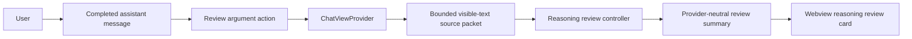
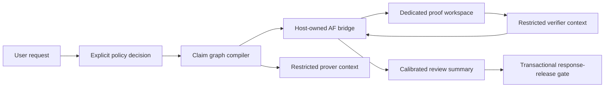

# Vibefeld Reasoning Review for OpenCode Scribe

## Status

This document is a design and implementation plan. The first proposed OpenSpec
change is a non-executing scaffold; it does not launch AF, modify sandbox
profiles, expose a model tool, or change normal Chat and Write behavior.

## Purpose

Vibefeld (`af`) can give OpenCode Scribe an optional, inspectable reasoning
review capability for arguments that benefit from explicit assumptions,
dependencies, objections, and calibrated conclusions. It must not be presented
as a theorem prover, evidence verifier, or source of private chain-of-thought.

The long-term goal is a persistent, adversarial review subsystem. The immediate
goal is a safe manual review surface that can evolve only after Scribe has
proven the required runtime, sandbox, delegated-model, and response-release
capabilities.

## Non-Goals

- Do not expose a general-purpose shell, terminal, package manager, script, or
  arbitrary process tool to a model.
- Do not invoke `af shell`, use arbitrary command strings, or let a model select
  an AF executable, workspace, environment, or command verb.
- Do not treat AF validation as Lean, Coq, or Isabelle semantic proof.
- Do not treat a clean proof structure as evidence that a source, premise,
  citation, empirical claim, or normative conclusion is true.
- Do not persist raw model reasoning, prompts, source packets, tool payloads, or
  full ledgers in ordinary UI state or diagnostic logs.
- Do not make AF review mandatory for ordinary conversation, drafting, lookup,
  translation, or creative work.
- Do not change the independent OpenCode TUI, global OpenCode configuration, or
  user nono profiles.

## Scribe Constraints

| Principle               | Requirement                                                                                                                                                                             |
| ----------------------- | --------------------------------------------------------------------------------------------------------------------------------------------------------------------------------------- |
| Product boundary        | Scribe is a research and report-writing extension. Full coding, shell, package, and unrestricted agent work remain in the independent TUI.                                              |
| Shared contracts        | `packages/core` contains provider-neutral types and protocols only. AF names, paths, CLI verbs, workspace paths, and parser details stay outside it.                                  |
| Host authority          | The VS Code extension host owns review requests and UI publication. A webview never owns runtime authority.                                                                             |
| No model-visible bridge | AF is never added as an OpenCode plugin, MCP server, custom tool, or`pluginSources` entry.                                                                                            |
| Least authority         | A future bridge uses fixed argv operations,`shell: false`, bounded input/output, validated JSON, and a dedicated OS process boundary.                                                 |
| Workspace isolation     | AF may write only a review directory outside the user repository. The current Chat sandbox is not sufficient because it grants the active workspace write access.                       |
| Fail safely             | Runtime absence, incompatibility, malformed output, timeout, cancellation, or audit failure produces an unavailable or unverified review result; ordinary Chat and Write remain usable. |
| Evidence separation     | Logical structure and evidence/source status are independent dimensions. A review must state this boundary visibly.                                                                     |
| Calibration             | UI wording distinguishes not reviewed, unavailable, conditional, unresolved, refuted, structurally checked, and audit-failed states.                                                    |

## Platform Facts

The intended design must follow the extension that exists today:

- The monorepo dependency direction is `packages/core` to
  `packages/agents/opencode` to `packages/platforms/vscode`.
- `packages/core` provides shared domain types, `IAgent`, and the typed
  webview/host protocol. It has no runtime dependencies and must remain
  provider-neutral.
- `OpenCodeAgent.sendMessage()` sends directly to OpenCode through
  `client.session.promptAsync()`. It has no API for a transactional
  draft/review/release lifecycle.
- `ChatViewProvider` forwards assistant events to the webview while they stream.
  It cannot currently withhold or rewrite an assistant response before users see
  it.
- The only injected Scout task target is `chat-research-worker`. Current policy
  does not permit `vibefeld-prover` or `vibefeld-verifier` child agents.
- The extension-owned OpenCode server and its descendants can run under nono or
  the compatibility sandbox. That policy grants the active workspace read/write
  access and therefore cannot be reused as proof-root isolation without a
  separately audited boundary.
- The VS Code package may use platform APIs and Node facilities but must not
  import `@opencode-ai/sdk` directly.
- The extension uses process-scoped OpenCode overlays. It must not rewrite the
  user's global `opencode.json`, project config, or nono profile files.

## Target Architecture

### Initial Manual Review



The initial flow is post-response and manual:

1. A user selects `Review argument` on a completed assistant message.
2. The webview posts a typed request containing the session and assistant
   message identifiers.
3. `ChatViewProvider` verifies the request against the active session and
   retrieves the authoritative message through `IAgent.getMessages()`.
4. The host extracts only visible assistant text into a bounded source packet.
   It excludes reasoning parts, tool input/output, file attachments, permission
   metadata, and raw prompts.
5. A host-owned review controller returns a provider-neutral summary.
6. The host posts the summary keyed by session and message. The webview renders
   it beneath the reviewed message.

The initial flow does not change the original answer, delay event forwarding,
invoke AF, invoke a subagent, or claim that the original answer was reviewed
before delivery.

### Deferred Full Review

The following architecture is a future target, not an implementation claim:



The bridge, restricted prover/verifier contexts, and response-release gate each
require their own verified capability. They must not be simulated with prompt
instructions, normal `task` delegation, or a plugin tool that a model may skip.

## Package Layout

The integration belongs in existing packages. Do not create a standalone
`opencode-plugin-vibefeld-cortex` package.

```text
packages/
  core/src/
    reasoning-review.ts                 # Provider-neutral review types/interfaces
    domain.ts                           # Re-exported message-facing types if needed
    protocol.ts                         # Typed UI <-> host review messages
    agent.interface.ts                  # No AF-specific methods or SDK details

  platforms/vscode/src/
    vibefeld/
      reasoning-review-controller.ts    # Host interface and unavailable scaffold
      reasoning-review-store.ts         # Session/message scoped summaries
      source-packet.ts                  # Visible-text extraction and limits
      vibefeld-runtime.ts               # Future runtime state only; no spawn in scaffold
      af-execution-boundary.ts          # Future direct-argv sandboxed runner
      af-command-schema.ts              # Future fixed operation union
      af-output-schema.ts               # Future versioned output validation
      proof-workspace-store.ts          # Future extension-storage workspace owner
    chat-view-provider.ts               # Request validation and publication
    extension.ts                        # Controller construction and lifecycle

  platforms/vscode/webview/
    components/organisms/ReasoningReviewCard/
    locales/
    App.tsx                             # Session/message keyed review state
    contexts/AppContext.tsx             # Review state/actions for MessageItem
    components/organisms/MessageItem/   # Manual action and card placement
```

The first change adds only the shared contract, unavailable controller, typed
host/webview route, and compact card. The future AF bridge remains inside the
platform package because it needs VS Code extension storage and a dedicated
process boundary; it does not need SDK access.

## Shared Data Model

The shared model is intentionally provider-neutral. It must not contain
`afNodeId`, a workspace path, a binary path, AF flags, or serialized ledger
data.

```ts
export type ReasoningReviewRuntimeState =
  | "unavailable"
  | "checking"
  | "incompatible"
  | "available";

export type ReasoningReviewStatus =
  | "not_reviewed"
  | "reviewing"
  | "structurally_checked"
  | "conditional"
  | "unresolved"
  | "refuted"
  | "blocked"
  | "audit_failed"
  | "unavailable";

export type ReasoningEvidenceStatus =
  | "not_assessed"
  | "not_required"
  | "source_recorded"
  | "unverified"
  | "human_verified"
  | "conflicted";

export type ReasoningReviewRuntime = {
  state: ReasoningReviewRuntimeState;
  reason?: string;
};

export type ReasoningReviewSummary = {
  reviewedMessageId: string;
  status: ReasoningReviewStatus;
  invocation: "manual" | "automatic";
  conclusion: string;
  assumptions: string[];
  evidenceStatus: ReasoningEvidenceStatus;
  openChallenges: Array<{
    severity: "critical" | "major" | "minor" | "note";
    target: string;
    reason: string;
  }>;
  interpretiveBoundary?: string;
  artifactHandle?: string;
};
```

`artifactHandle` is opaque. Only a future Vibefeld adapter may map it to an AF
workspace or node identity. The webview must never receive a filesystem path,
raw ledger, source packet, prompt, or model reasoning trace.

The scaffold adds these protocol messages:

```ts
type UIToHostMessage =
  | { type: "requestReasoningReview"; sessionId: string; messageId: string }
  | { type: "cancelReasoningReview"; sessionId: string; messageId: string };

type HostToUIMessage =
  | { type: "reasoningRuntime"; runtime: ReasoningReviewRuntime }
  | { type: "reasoningReview"; sessionId: string; summary: ReasoningReviewSummary };
```

The host, not the webview, owns review state. It clears summaries for deleted
sessions and ignores summaries for a session that is no longer active.

## Review Controller

`IReasoningReviewController` is a platform-owned interface injected into
`ChatViewProvider`; it is not an `IAgent` method and does not alter the
OpenCode SDK adapter.

```ts
export interface IReasoningReviewController {
  getRuntime(): Promise<ReasoningReviewRuntime>;
  review(input: {
    sessionId: string;
    messageId: string;
    sourceText: string;
  }): Promise<ReasoningReviewSummary>;
  cancel(sessionId: string, messageId: string): void;
}
```

The scaffold provides `UnavailableReasoningReviewController`. It returns an
`unavailable` summary with a bounded reason and performs no process launch,
filesystem write, plugin discovery, model prompt, or configuration update. This
lets the protocol, UI, and fallback behavior be tested before the runtime
boundary exists.

## Runtime and Sandbox Prerequisite

AF execution is blocked until a phase-0 contract proves all of the following:

- The exact installed AF version, supported JSON output, non-zero exit
  categories, workspace format, and required runtime paths are captured in
  fixtures. No command syntax or exit-code table is accepted from documentation
  alone.
- A dedicated OS process policy permits the approved AF executable, required
  read-only runtime files, and a per-review workspace below extension storage.
  It denies writes to the user workspace, home directory, OpenCode state, and
  sibling review workspaces.
- The policy applies to AF and all descendants. It is independent of the
  extension-owned OpenCode companion policy.
- Scribe neither creates, edits, promotes, nor broadens a nono profile. If the
  user must supply a profile or equivalent boundary, Scribe persists only a
  validated selection and fails closed when it is absent or invalid.
- The final runner can use direct argv execution with `shell: false`, a fixed
  executable supplied by the resolved runtime, an internally resolved workspace,
  bounded stdout/stderr, timeout cleanup, and no inherited unreviewed arguments.

When a real runtime is eventually enabled, proof directories should be under a
workspace-hashed, session-scoped directory beneath `context.globalStorageUri`,
not the repository or an unrestricted temporary directory. Retention, export,
and deletion policies remain deferred until the proof boundary is proven.

## Future AF Bridge

After the runtime prerequisite, define a discriminated TypeScript operation
union. The model never produces argv or command strings. Each operation has a
versioned input schema, expected JSON schema, output byte limit, timeout, and
typed error mapping.

The exact AF allowlist must be derived from captured fixtures. Tentative verbs
such as `version`, `status`, `get`, `jobs`, `challenges`, `defs`, `assumptions`,
`audit`, `init`, `claim`, `refine`, `challenge`, `resolve-challenge`, and
`accept` are not approved until phase 0 validates their syntax, authorization,
and idempotence. `add-external` is explicitly not assumed to exist.

The bridge must reject `shell`, interactive modes, workspace upgrades, archive,
admission, force flags, `--allow-self`, confirmation bypasses, unknown verbs,
unknown flags, external paths, and arguments that alter executable or workspace
selection. A failed or malformed operation maps to `audit_failed` or
`unavailable`; it never produces a guessed proof state.

## Reasoning and Evidence Policy

The first executable review will remain explicit and message-bound. Automatic
routing is deferred until it can be measured against a reviewed evaluation
corpus and users can see why a request was selected.

For a future claim graph, the compiler must produce the smallest graph that
exposes relevant inferential risk:

1. State the candidate conclusion in one sentence.
2. Classify each major claim as deductive, computational, empirical,
   procedural, interpretive, or normative.
3. Record explicit and material hidden assumptions.
4. Separate logical dependencies from evidence dependencies.
5. Split multi-inference prose into attackable claims.
6. Reject duplicate identifiers, cycles, missing dependencies, excessive length,
   or configured node/depth limits before AF initialization.

Evidence remains host metadata. An empirical claim with only recorded or
unverified evidence cannot be shown as `structurally_checked`; it is at most
`conditional`. Contradictory sources produce `conflicted` evidence status,
regardless of any structural AF result. Sources are treated as untrusted data,
not instruction authority.

## Prover, Verifier, and Response Gate Prerequisites

The plan does not currently authorize `vibefeld-prover` or
`vibefeld-verifier`. Introducing them requires a separate security-reviewed
change that proves a restricted, hidden child-model API can:

- create independent contexts without granting repository read, edit, Bash,
  arbitrary task delegation, package, terminal, or AF workspace access;
- accept a bounded source packet and return schema-constrained proposals rather
  than commands;
- assign distinct provenance identities and reject self-acceptance; and
- handle cancellation, malformed proposals, and model failure without
  broadening permissions or forcing an accepted result.

Likewise, response wording can only be mandatory after OpenCode or Scribe
provides a real transactional draft/review/release insertion point. Until then,
the review card is an after-the-fact supplement and the original response must
not be described as gated.

## User Experience

The initial card is compact and separate from streamed model reasoning. It shows
the status, assumption count, evidence status, and the highest-severity open
challenge. It may expand to show the bounded assumption and challenge lists.
It must not show AF ledger data, private reasoning, source-packet content,
workspace paths, raw errors, or model prompts.

The scaffold shows `Review argument` for a completed assistant message so the
typed request and unavailable fallback are testable end to end. With no runtime,
the request returns an `unavailable` card and does not launch a process or write
state. A later runtime change may disable the action when AF is unavailable or
incompatible. The scaffold must not add a Settings checkbox before runtime
compatibility and the execution boundary are proven.

In a later runtime change, an availability-gated `Enable Vibefeld reasoning review` control may be added to `ToolConfigPanel`. Its user preference is stored
through VS Code configuration at the Global target and its effective state is
`userEnabled && runtime.state === "available"`. A workspace may opt out, but an
absent or incompatible runtime must not render a non-functional control.

## OpenSpec Outline: Scaffold

Create one change named `add-vibefeld-review-scaffold`:

```text
openspec/changes/add-vibefeld-review-scaffold/
  .openspec.yaml
  proposal.md
  design.md
  tasks.md
  specs/
    vibefeld-reasoning-review/
      spec.md
```

### Proposal Scope

Add provider-neutral review types, typed webview/host messages, a host-owned
unavailable controller, per-message review state, and a compact localized card.
This change deliberately performs no AF runtime discovery or execution.

### Design Decisions

- Keep AF-specific state outside `packages/core`.
- Inject `IReasoningReviewController` into `ChatViewProvider`; do not change
  `IAgent`, `pluginSources`, OpenCode overlays, or OpenCode tool permissions.
- Associate a summary with an existing completed assistant message rather than a
  synthetic OpenCode message part, since OpenCode does not persist this review
  state.
- Treat source extraction, result publication, session filtering, cancellation,
  and state clearing as host responsibilities.
- Use a separate card rather than `ReasoningPartView`, which renders streamed
  model reasoning and must not display proof artifacts.

### Required Specification Scenarios

- An unavailable review runtime leaves ordinary Chat and Write unchanged.
- A manual request is accepted only for a completed assistant message in the
  specified active session.
- A rejected request does not read another session or expose message/tool data.
- Visible assistant text is bounded before it reaches the controller.
- A summary is rendered beneath only its matching assistant message.
- Switching or deleting a session clears or ignores stale review state.
- The card distinguishes unavailable, reviewing, conditional, unresolved,
  refuted, structurally checked, and audit-failed states.
- The scaffold starts no child process, writes no proof workspace, adds no plugin
  source, and changes no Scout, Write, worker, MCP, or sandbox permission.
- Every user-facing string exists in every webview locale dictionary.

### Tasks

1. Add provider-neutral `reasoning-review.ts` types and core protocol unions,
   export them from the core barrel, and add focused core tests.
2. Add `IReasoningReviewController` and the unavailable controller under
   `packages/platforms/vscode/src/vibefeld/`, with tests proving that it has no
   process, filesystem, or configuration side effects.
3. Inject the controller through `extension.ts` into `ChatViewProvider`; validate
   manual requests, construct bounded visible-text packets, and publish runtime
   and summary messages.
4. Add App-level message-keyed state, a `ReasoningReviewCard`, MessageItem action
   placement, styles, locale keys, and webview scenarios.
5. Add extension-host negative tests covering stale sessions, invalid message
   identifiers, cancellation, unavailable runtime, and no permission/launch
   configuration changes.
6. Run focused core, extension-host, and webview tests, then `pnpm run check`,
   `pnpm run build`, `pnpm run test:all`, `openspec validate add-vibefeld-review-scaffold --strict`, and `git diff --check`.

## Follow-On OpenSpec Changes

Do not combine these with the scaffold:

1. `add-vibefeld-runtime-contract`
   - Capture AF fixtures and decide the dedicated OS process boundary without
     changing normal Chat behavior.
2. `add-vibefeld-runtime-bridge`
   - Add the fixed operation union, runtime compatibility preflight, dedicated
     proof storage, sandbox enforcement, and opt-in integration tests.
3. `add-vibefeld-claim-projection`
   - Implement bounded claim graph validation, AF projection, evidence
     separation, status mapping, and manual review results.
4. `add-vibefeld-adversarial-review`
   - Add restricted prover/verifier contexts only after a reviewed child-model
     contract and permission model exist.
5. `add-vibefeld-response-gate`
   - Add required pre-release review only after a transactional draft/review/
     release lifecycle exists and has end-to-end tests.
6. `add-vibefeld-automatic-routing`
   - Add measured automatic routing only after manual review meets latency,
     calibration, and false-challenge targets.

## Evaluation and Release Criteria

The scaffold release is complete when the typed contract, manual request route,
unavailable fallback, compact card, session isolation, localization, and
negative security tests are complete. It must not claim that AF execution,
adversarial review, automatic routing, or response gating exists.

The first AF-executing release is complete only when a real child process is
confined to a dedicated proof workspace, every command is typed and fixture
validated, malformed or failed operations downgrade safely, and the user can
distinguish structural status from evidence status. Adversarial review and a
mandatory response gate remain incomplete until their separate prerequisites
are satisfied.

## Response Language

Use calibrated wording once a real review exists:

| Status                              | Required language                                                                     |
| ----------------------------------- | ------------------------------------------------------------------------------------- |
| `structurally_checked`            | "The recorded argument supports this conclusion under the stated assumptions."        |
| `conditional`                     | "This conclusion depends on the stated assumption or unverified evidence."            |
| `unresolved`                      | "The conclusion is not established; the central open objection is..."                 |
| `refuted`                         | "The proposed claim fails because..."                                                 |
| `audit_failed`                    | "This reasoning check did not complete reliably and should be treated as unverified." |
| `unavailable` or `not_reviewed` | Do not imply formal or adversarial review.                                            |

No response may say "proven true" unless the reviewed task is explicitly
limited to a stated formal system and a separately approved wording policy
permits that statement.

## Risks and Mitigations

| Risk                                           | Mitigation                                                                                        |
| ---------------------------------------------- | ------------------------------------------------------------------------------------------------- |
| False confidence from a clean tree             | Separate structural and evidence status; require calibrated language.                             |
| AF writes outside the proof root               | Do not execute AF until a dedicated OS boundary is proven.                                        |
| Model bypasses review                          | Do not claim gating before a real release hook exists.                                            |
| Existing delegation boundary is widened        | Keep prover/verifier work out of the scaffold and require a separate security review.             |
| AF version drift                               | Capture versioned fixtures and disable the runtime on incompatibility.                            |
| Prompt injection in sources                    | Extract bounded source data, keep it out of system instructions, and never treat it as authority. |
| Proof verbosity harms the UI                   | Render a compact card by default; defer ledger inspection.                                        |
| Overformalizing humanities or empirical claims | Preserve claim class and interpretive/evidence boundaries.                                        |

## Source References

- [OpenCode plugin documentation](https://opencode.ai/docs/plugins/)
- [OpenCode tools and permissions documentation](https://opencode.ai/docs/tools/)
- [Vibefeld README](https://github.com/tobiasosborne/vibefeld)
- [Vibefeld architecture](https://github.com/tobiasosborne/vibefeld/blob/main/docs/architecture.md)
- [Vibefeld concepts](https://github.com/tobiasosborne/vibefeld/blob/main/docs/concepts.md)
- [Vibefeld CLI reference](https://github.com/tobiasosborne/vibefeld/blob/main/docs/cli-reference.md)
- [Vibefeld trust model](https://github.com/tobiasosborne/vibefeld/blob/main/docs/trust-model.md)

## Addendum: Activation Path

Date: 2026-09-21.

### Status of This Plan's Follow-On Changes

All six follow-on changes now exist under `openspec/changes/` with completed
task ledgers and private implementations under
`packages/platforms/vscode/src/vibefeld/`:

| Change                            | Implemented capability                                           | Production state                |
| --------------------------------- | ---------------------------------------------------------------- | ------------------------------- |
| `add-vibefeld-review-scaffold`  | Neutral types, typed route, unavailable controller, review card  | Wired; always `unavailable`     |
| `add-vibefeld-runtime-contract` | Pinned AF 0.1.7 evidence, validators, boundary requirements      | Non-executing                   |
| `add-vibefeld-runtime-bridge`   | Proof store, policy seam, executor, compatibility bridge         | Not constructed in production   |
| `add-vibefeld-claim-projection` | Claim graph, evidence separation, status mapping                 | Capability hard-coded unsupported |
| `add-vibefeld-adversarial-review` | Prover/verifier contract, orchestration, mapper                | Default seam unsupported        |
| `add-vibefeld-response-gate`    | Draft/review/release state machine, publication seam             | Fixture-only, not wired         |
| `add-vibefeld-automatic-routing` | Policy, lifecycle, evaluation                                   | Dormant; no qualified corpus    |

The repository therefore contains the full review pipeline as host-private,
tested contracts. It does not contain an activation path. `extension.ts`
still constructs `UnavailableReasoningReviewController`, the security-negative
suite pins that construction, the AF output parsers accept only the
repository's sanitized fixture schema, no production code supplies an
`AfExecutionPolicyAdapter`, and no discovery, proof-store construction, or
user setting exists.

### Gap: No Activation Change Exists

The six changes stop at "capability contract proven in tests". The remaining
work is a new change, `add-vibefeld-activation`, that turns the dormant
pipeline on when AF is present and leaves ordinary Chat and Write unchanged
when it is not.

### `add-vibefeld-activation` Scope

1. Discovery and pin: resolve the host-owned `af` executable from fixed
   candidate locations plus `PATH`, verify the pinned version, commit, and
   workspace-format identity against captured fixtures (`af` 0.1.7 / commit
   `5a37413` / workspace format `1.0`), and stay dormant without side effects
   when AF is absent, incompatible, unsupported, or the policy is not ready.
2. Production policy provider: implement `AfExecutionPolicyAdapter` for
   macOS/Linux against a documented AF-specific draft nono profile that the
   user promotes once outside Scribe, mirroring the existing nono profile
   selection UX. Scribe persists only a validated selection and fails closed
   when it is absent or invalid; Scribe never creates, edits, or promotes nono
   profiles, and must not reuse the Chat sandbox policy.
3. Live output contract: capture real, sanitized `af version`, `schema`,
   `init`, and `status --json` output and derive live parsers from it. The
   fixture-schema parser stays a test double; production must never accept
   fixture-shaped output as evidence of a live runtime, and the two parsers are
   separate and explicitly selected by mode.
4. Controller selection and publication: construct the proof store under
   `context.globalStorageUri`, preflight the bridge once per extension
   activation, inject the claim-projection controller when the runtime is
   ready, and publish runtime status so the review card distinguishes
   unavailable, checking, incompatible, and available.
5. Preference semantics: when AF is available and the policy is ready,
   reasoning review is on by default with a per-workspace opt-out. Store the
   preference at the Global target, gate the `ToolConfigPanel` control on
   availability, and never render a non-functional control when AF is absent or
   incompatible. This supersedes the earlier opt-in-first wording.
6. Automatic-routing enablement: inject the qualified evaluation and enable
   selection while keeping the existing fail-closed policy and thresholds
   (`automatic-routing-evaluation.ts`) unchanged; no selection unless the
   evaluation validates as qualified, the runtime is available, and the policy
   signals pass. The existing bounded rationale rendering is reused.
7. Hybrid qualification pipeline: validate the pipeline against a versioned
   30–50 case adjudicated seed corpus, then accumulate host-private live
   outcome capture to the 100-case minimum. Qualification stays aggregate-only
   and host-private; the seed corpus is a versioned repo artifact; live capture
   records latency automatically, derives `challenged` from review status, and
   collects `correct`/`falseChallenge` through bounded local review-card
   feedback. No Hindsight runtime coupling.
8. Security-negative amendment: replace the assertions that forbid any bridge
   import in `extension.ts` and `chat-view-provider.ts` with assertions that
   permit only the constrained wiring (fixed argv, required ready policy,
   host-owned workspace, bounded output) while retaining every prohibition on
   plugins, MCP, custom tools, agent overlays, `IAgent`/protocol AF fields,
   arbitrary argv, and unsandboxed retries.

### Decisions Taken (2026-09-21)

- **Response gate dismissed.** Post-response review is the final semantics.
  There is no buffering or hold-before-release; live streaming is preserved.
  The existing response-gate implementation stays a fixture-level contract and
  is never activated. Do not create a gate change.
- **Adversarial review deferred.** It moves to a separate follow-up change,
  `add-vibefeld-restricted-contexts`, created only after activation proves
  useful. It is independent of AF (it critiques the claim graph) and requires
  its own security review for a restricted tool-less child-model context. No
  `vibefeld-prover`/`vibefeld-verifier` agents, tools, or plugins.
- **Automatic routing folded into activation.** The deliverable injects the
  qualified evaluation and enables selection. Qualification is hybrid: a 30–50
  case adjudicated seed corpus validates the pipeline, then host-private live
  outcome capture accumulates reviews to the 100-case minimum. The selection
  policy and thresholds (`automatic-routing-evaluation.ts`) are unchanged.
- **Hindsight boundary.** Hindsight is an offline corpus-research aid only,
  used by developers. It is never a runtime routing input and never an
  automatic recipient of review state; qualification aggregates remain
  host-private; no automatic ingestion of review content into memory.
- **Policy provider selection.** The provider is a documented AF-specific draft
  nono profile that the user promotes once outside Scribe, mirroring the
  existing nono profile selection UX. Scribe only persists a validated profile
  selection and fails closed when it is absent or invalid; Scribe never
  creates, edits, or promotes nono profiles.
- **Direct execution replaces the AF nono profile (KISS).** Vibefeld AF uses no
  nested nono profile and no second sandbox. AF runs directly as a bounded child
  process of the extension host under whatever enclosing sandbox the user's
  session already has (none is claimed or required), with fixed host-owned argv,
  `shell: false`, an allowlisted environment, bounded I/O, and
  terminate-and-reap. There is no AF profile, no profile-selection or promotion
  flow, no runtime grants, and no denied-domain attestation; readiness is
  `{ state: "ready", execution: "direct" }` on supported platforms with a
  compatible executable. If AF needs additional allows under the user's nono
  profile, the standard nono skill flow (`nono why` plus a drafted profile
  promotion) handles it outside Scribe. The "AF sees only the ephemeral proof
  workspace" isolation guarantee is withdrawn as a design goal; the proof
  workspace remains only AF's working directory for review scratch. This
  supersedes the policy provider selection decision above, the corresponding
  addendum scope wording, and the dedicated-policy completion criteria.
- **Compatibility is format-pinned and version-tolerant.** Support requires an
  `af` version matching `^0\.1\.\d{1,3}$` (the 0.1.x line), a `format` exactly
  `1.1`, and all required version fields present, bounded (≤256 characters),
  and safe; `version`, `commit`, `build_date`, `go_version`, and `policy` are
  recorded as host-private metadata but never exact-matched, so exact commit
  equality does not gate support. Platform and architecture are host-derived
  (`process.platform` in {darwin, linux}; `process.arch` in {arm64, x64, arm,
  ia32}); real `af version --json` output exposes no OS or architecture and is
  not expected to. Fail closed: missing, malformed, oversized, unsafe, or
  ambiguous fields and unsupported host platforms stay dormant `unavailable`;
  a version outside 0.1.x or `format` other than `1.1` stays dormant
  `incompatible`. This supersedes the pinned-identity wording in the addendum
  scope above: the earlier 0.1.7 / commit `5a37413` / workspace format `1.0`
  evidence was stale, replaced by sanitized real captures (2026-09-21: `af`
  0.1.11, commit `611291b`, format `1.1`, policy `0.1.9`, build
  `2026-09-21T00:24:48Z`, go `go1.27.1`), and the synthetic
  `af-runtime-fixture-1` envelope is retired to test-double status. AF is under
  active development, so version and commit bumps within the 0.1.x line with a
  valid `format` and field shape must not force dormancy.

### Activation Completion Criteria

`add-vibefeld-activation` is complete only when: AF is discovered and pinned;
the dedicated policy is enforced or the runtime stays dormant; live fixtures
replace fixture-shaped parsing; the injected controller is selected
dynamically; automatic routing selects only when the evaluation validates as
qualified; the hybrid qualification pipeline and its escape hatches are in
place; no response is claimed as gated; ordinary Chat, Write, Scout, MCP,
sandbox, and the independent TUI are provably unchanged when AF is absent or
the policy is unavailable; and the amended security-negative suite still fails
closed on any broader authority.
